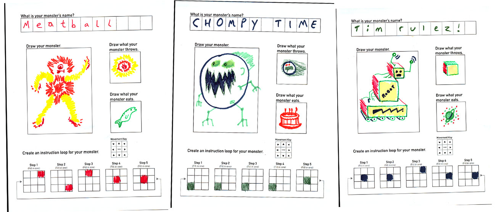

#Paper Hero Game



This game system was prototyped for a Day-Of-Code event. It allows visitors to draw a character on paper, scan it into the system, then use their phone as a controller to play in a multiplayer game using their own character. 

The ```paper-art-eater``` system is used to quickly scan and export the art and assets. See [```paper-art-eater```](https://github.com/scimusmn/paper-art-eater "paper-art-eater") repo for details.

